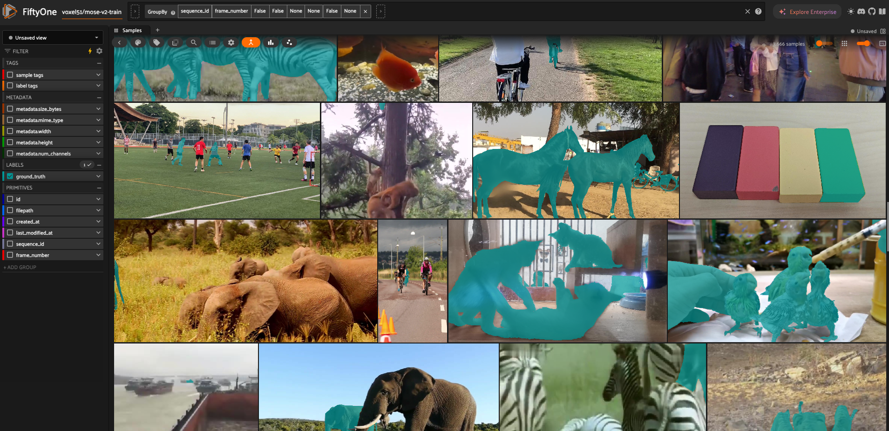
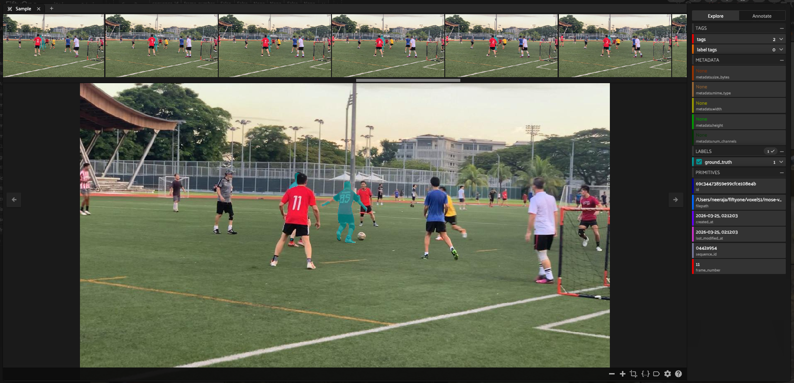

# mose-v2

FiftyOne Dataset with the MOSEv2 large-scale video object segmentation benchmark.

## Details

- Original website / project: https://mose.video/
- HuggingFace: https://huggingface.co/datasets/FudanCVL/MOSEv2
- Archives (train / validation): Google Drive — file IDs live in `__init__.py` as `DRIVE_FILE_IDS`
- Citation: use the BibTeX from the [official MOSEv2 repository](https://github.com/FudanCVL/MOSEv2).

- Tags: image, segmentation, video-object-segmentation
- Supported splits: train, validation

To download archives via the Dataset Zoo you need [gdown](https://github.com/wkentaro/gdown):

```bash
pip install gdown
```

## Example Usage

```
import fiftyone as fo
import fiftyone.zoo as foz

dataset = foz.load_zoo_dataset(
    "https://github.com/voxel51/mose-v2",
    split="train",
)

session = fo.launch_app(dataset)
session.wait()
```

## Statistics

| Split       | Sequences | Total Samples | Annotated Samples      |
|-------------|-----------|---------------|------------------------|
| train       | 3,666     | 311,843       | 311,843                |
| validation  | 433       | 66,526        | 433 (first frame only) |

Validation frame counts were taken from a full `valid/JPEGImages` tree (433 sequence folders, all `*.jpg` under each). Recompute anytime with `python scripts/count_val_frames.py /path/to/parent` where `parent/valid/JPEGImages/...` matches the MOSE layout.

## Visualize

Each image is tagged with its **split** and with its **sequence** name — frames that share a `sequence_id` belong to the same clip.

Segmentation is stored in the `ground_truth` field as a `Segmentation` (indexed PNG; instance id per pixel).

Below is the dataset in **image** format (one sample per frame):



For a **video-like** browser in the App, use a dynamic grouped view — one group per sequence, frames ordered by `frame_number` (same idea as in [`test_mose.py`](test_mose.py)):

```
grouped = dataset.group_by("sequence_id", order_by="frame_number")
session = fo.launch_app(grouped)
session.wait()
```


